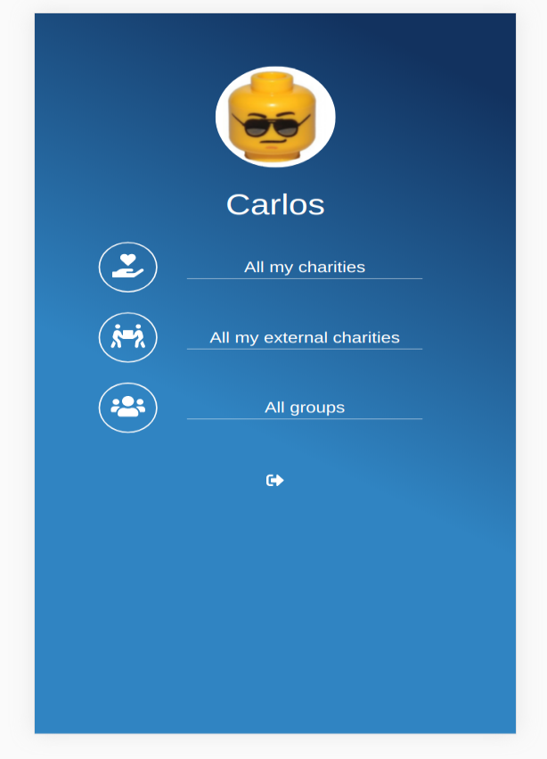

# Private-events

> App to create groups for charity events

Site similar to Snapscan an app for grouping payments by goal with your family/friends, which allows users to create  charity events and add them to a group.

## Built With

- Ruby
- Ruby on Rails
- postgreSQL

## Live Demo

[Live Demo Link](https://floating-chamber-75048.herokuapp.com/)

To get a local copy up and running follow these simple example steps.

### Prerequisites

- Ruby
- Ruby on Rails
- SQLite3
- yarn
- Node.js

### Setup

- Clone the project with `git clone https://github.com/sjcco/charityverse`.
- Run `bundle install` to obtain all dependecies required by the app.
- Run `rails webpacker:install` to install the configured webpack file.
- Run `rails db:migrate` to create the tables whithin the db.

### Usage

- Start the server in a new terminal by navigating to the project folder and using `bin/rails server`
- Visit [this page](http://localhost:3000/) to see the landing page with the login and sign up screen.
- To navigate to a certain event you first need to sign in or sign up.

## Authors

👤 **Juan Carlos Campos**

- GitHub: [@sjcco](https://github.com/sjcco)
- Twitter: [@CarlosCamposO](https://twitter.com/CarlosCamposO)

## 🤝 Contributing

Contributions, issues, and feature requests are welcome!

Feel free to check the [issues page](https://github.com/sjcco/charityverse/issues/).

## Show your support

Give a ⭐️ if you like this project!

## Acknowledgments

- Microverse team
- The Odin Project
- Original designer: [Gregoire Vella](https://www.behance.net/gallery/19759151/Snapscan-iOs-design-and-branding?tracking_source=)

## 📝 License

This project is [MIT](lic.url) licensed.
